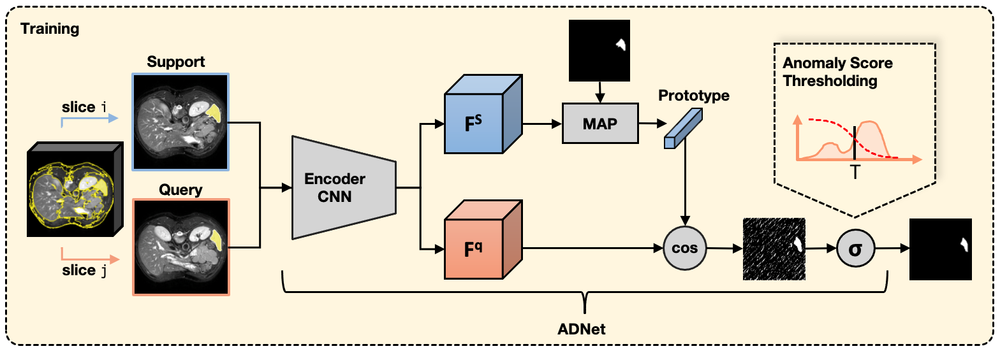

# ADNet
Code for the paper "Anomaly Detection-Inspired Few-Shot Medical Image Segmentation Through Self-Supervision With Supervoxels".

#### Abstract
Recent work has shown that label-efficient few-shot learning through self-supervision can achieve promising medical image segmentation results. However, few-shot segmentation models typically rely on prototype representations of the semantic classes, resulting in a loss of local information that can degrade performance. This is particularly problematic for the typically large and highly heterogeneous background class in medical image segmentation problems. Previous works have attempted to address this issue by learning additional prototypes for each class, but since the prototypes are based on a limited number of slices, we argue that this ad-hoc solution is insufficient to capture the background properties. Motivated by this, and the observation that the foreground class (e.g., one organ) is relatively homogeneous, we propose a novel anomaly detection-inspired approach to few-shot medical image segmentation in which we refrain from modeling the background explicitly. Instead, we rely solely on a single foreground prototype to compute anomaly scores for all query pixels. The segmentation is then performed by thresholding these anomaly scores using a learned threshold. Assisted by a novel self-supervision task that exploits the 3D structure of medical images through supervoxels, our proposed anomaly detection-inspired few-shot medical image segmentation model outperforms previous state-of-the-art approaches on two representative MRI datasets for the tasks of abdominal organ segmentation and cardiac segmentation.

# Getting started
### Dependencies
... 

### Data sets and pre-processing
Download:
1) [Combined Healthy Abdominal Organ Segmentation data set](https://chaos.grand-challenge.org/)
2) [Multi-sequence Cardiac MRI Segmentation data set](https://zmiclab.github.io/projects/mscmrseg19/) (bSSFP fold)

Pre-processing is performed according to [Ouyang et al.](https://github.com/cheng-01037/Self-supervised-Fewshot-Medical-Image-Segmentation/tree/2f2a22b74890cb9ad5e56ac234ea02b9f1c7a535) and we follow the procedure on their github repository.

### Training
1. Compile `./supervoxels/felzenszwalb_3d_cy.pyx` with cython (`python ./supervoxels/setup.py build_ext --inplace`) and run `./supervoxels/generate_supervoxels.py` 
2. Download pretrained 3D ResNeXt weights from `<insert link>` (for 3D version) 
3. Run `./script/train_<abd, cmr>_<2D, 3D>.sh` 

### Inference
Run `./script/test_<abd, cmr>_<2D, 3D>.sh` 
